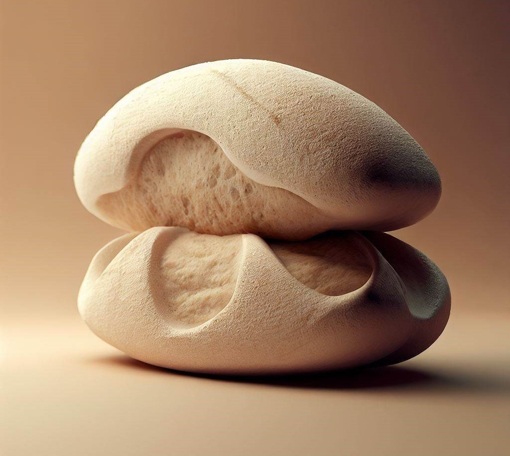

<h1 align="center">
Baker's percentage calculator
</h1>

<p align="center">
    
</p>

<p align="center">
<a href="#introduction">Introduction</a> •
  <a href="#key-features">Key Features</a> •
  <a href="#how-to-use">How To Use</a> •
  <a href="#download">Download</a> •
  <a href="#the-sourdough-framework">The Sourdough Framework</a> •
  <a href="#license">License</a>
</p>

## Introduction

Imagine baking as a fun adventure, where we use special math to make delicious treats! Our Baker's Calculator is like a magical tool that helps us figure out how much of each ingredient we need. We can even use it to make our recipes bigger or smaller. It's simple! We just divide the weight of an ingredient by the weight of the flour, and then we multiply by 100. That gives us the special number called the baker's percentage. We can do this for everything we put in our recipes, like butter, sugar, and even water. With our friendly calculator, baking becomes super easy and super yummy!

## Key Features

* Ingredient Ratio Calculation: The calculator allows you to determine the precise ratios of ingredients in a recipe, expressed as a percentage of the flour weight. It helps you maintain consistency and accuracy in your baking.
* Flexible Ingredient Support: The calculator supports a wide range of ingredients, including flour, water, yeast, salt, sugar, fats, and other mix-ins commonly used in baking. It allows you to calculate the percentages for any ingredient in your recipe.
* Easy-to-Use Interface: The calculator provides a user-friendly interface that simplifies the process of entering ingredient weights and obtaining the corresponding percentages. It ensures a smooth and intuitive user experience.
* Scaling Capabilities: The calculator enables easy scaling of recipes by adjusting ingredient quantities while preserving the desired ratios. It helps you adapt recipes to different batch sizes without compromising the integrity of the formula.
* Quick and Accurate Results: The calculator performs calculations instantly, providing accurate baker's percentages with minimal effort. It saves time and reduces the likelihood of human error when manually calculating ingredient ratios.
* Web version
  -  Recipe Management: Advanced calculators offer the ability to manage and save multiple recipes, allowing you to store and retrieve your preferred formulas for future use. 

**These features collectively enhance the precision, consistency, and scalability of your baking recipes, making the Baker's Percentage Calculator an invaluable tool for both amateur and professional bakers.**

## How To Use

> You can run `npm install bakers-math`

To clone and run this application, you'll need [Git](https://git-scm.com) and [Node.js](https://nodejs.org/en/download/) (which comes with [npm](http://npmjs.com)) installed on your computer. From your command line:

```bash
const RecipeCreator = require('bakers-math')

// Example usage
const creator = new RecipeCreator('Pizza', 120);

creator.setQuantity(10); // Set the desired quantity to 10

creator.addIngredient('Water', 60);
creator.addIngredient('Yeast', 2);
creator.addIngredient('Salt', 1);
creator.addIngredient('Sugar', 5);
creator.addIngredient('Sourdough', 8);

const recipe = creator.createRecipe();

console.log(recipe);
console.log(`Recipe quantity: ${recipe.quantity}`);
console.log(`Recipe ingredient: ${recipe.ingredients[0].name}`);
console.log(`Recipe weight: ${recipe.ingredients[0].weight}`);
```


## The Sourdough Framework

[It's an open-source book dedicated to helping you to make the best possible sourdough bread at home.](https://github.com/hendricius/the-sourdough-framework)


## License

[MIT](./LICENSE)

---

> &nbsp;&middot;&nbsp;
> GitHub [@talescript](https://github.com/talescript) &nbsp;&middot;&nbsp;


